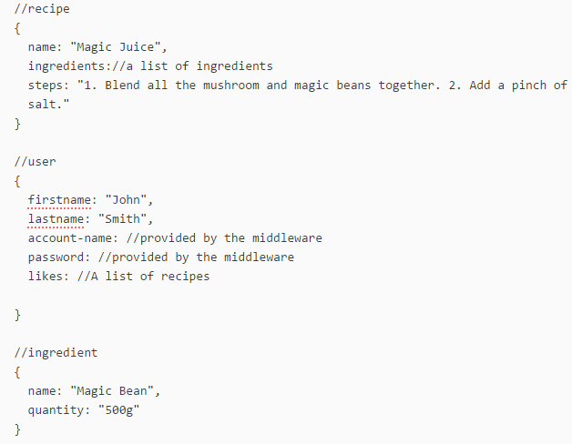
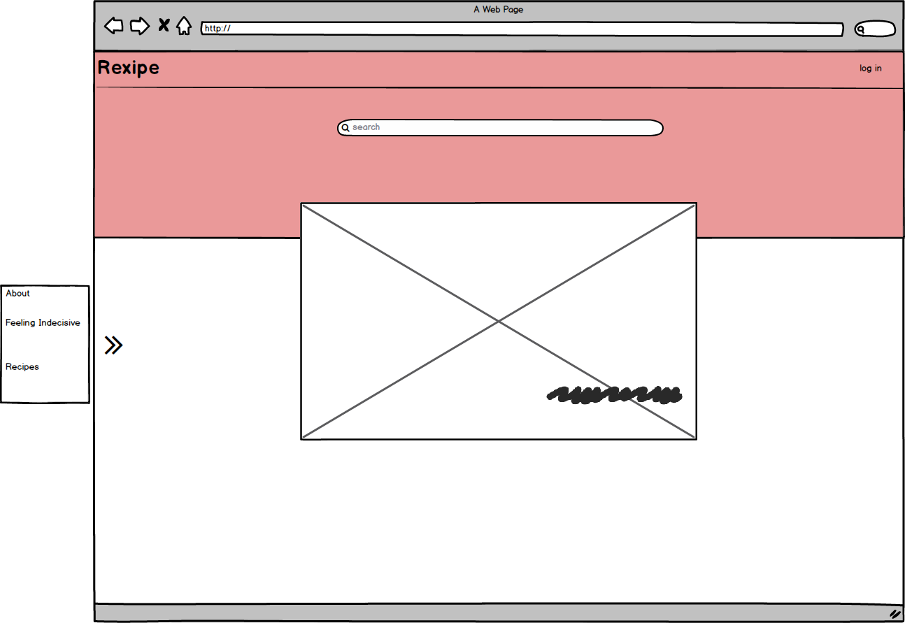
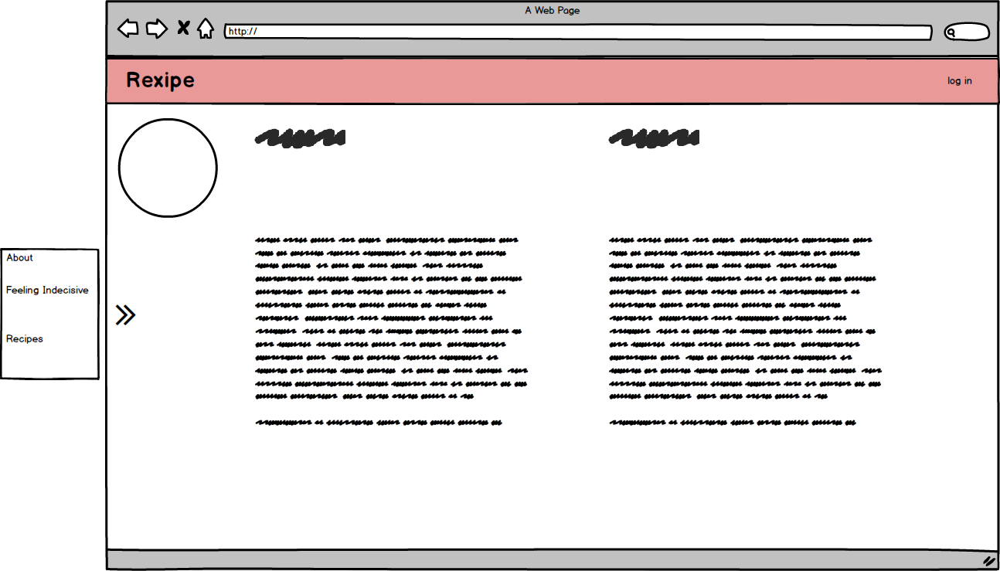
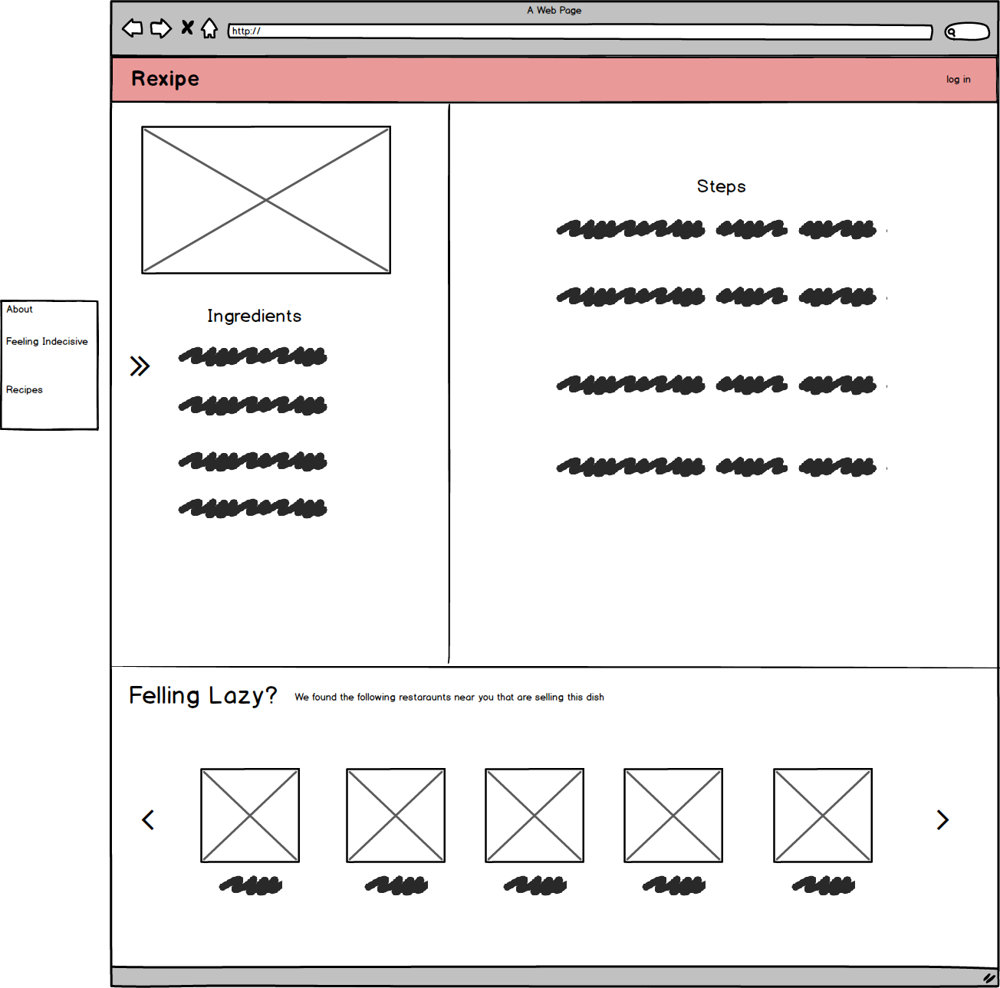
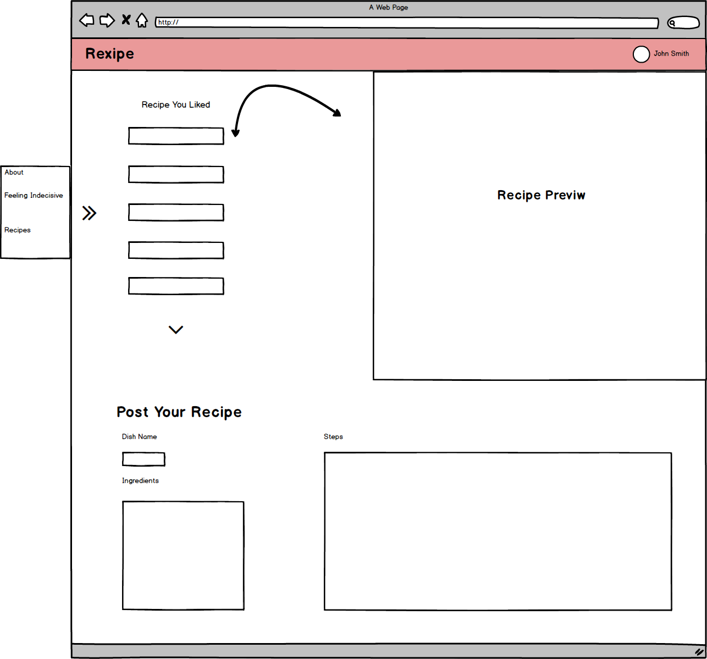
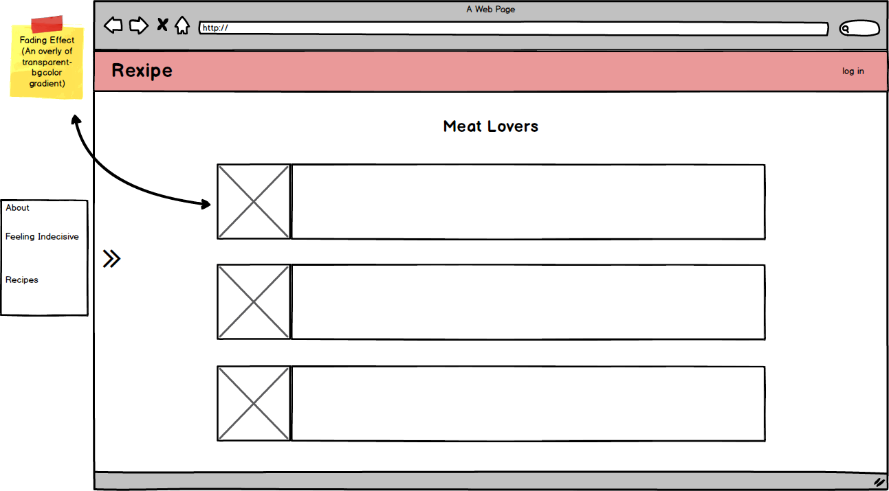
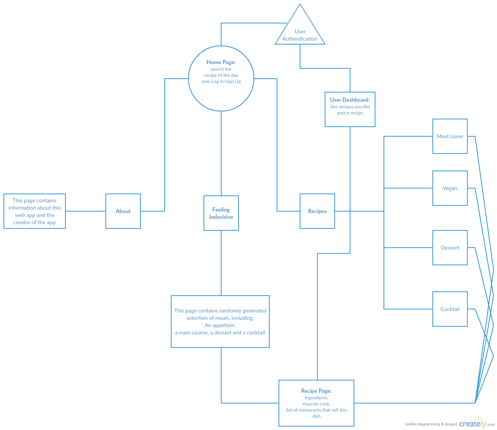

This is a final project for 480: Applied Internet Technology by Longkun Yang
# Recipe

## Overview

This is a webisite for you to look up recipe, browse great food pictures or even find out which restaurant is selling the food you are craving for, with great ease.

## Data Model

This is an example of how the data is stored

Please click [here](db.js) to view the first draft of the data schema

___TODO___: Data Model to be added

## Wireframe

___TODO___: WireFrame to be added

WHat you see when you enter the site

What you see after you click "About"

How a recipe is displayed

What you see when you log in

What you see when you click on any of the sub-tab under "Recipe"

## Site Map

___TODO___: Site Map to be added

## User Stories

- As a user, I can search for recipes
- As a user, I can see which restaraunts are selling a certain dish in a specific area
- As a beta user, I can register an account
- As a registered user, I can log in to user dashboard
- As a registered user, I can bookmark recipes that I like
- As a registered user, I can contribute my own recipes

